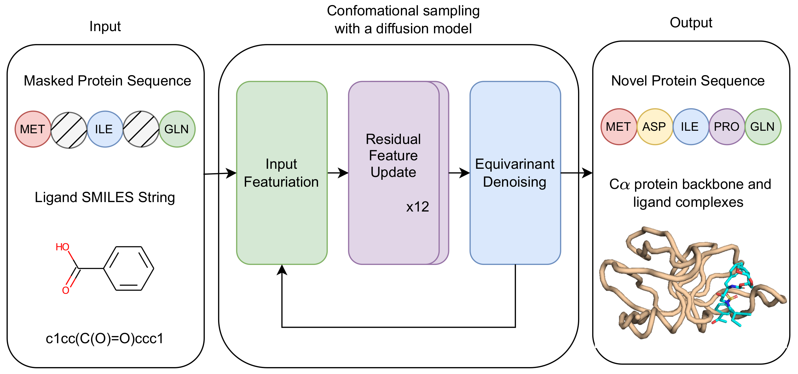

# Complex-based Ligand-Binding Proteins Redesign by Equivariant Diffusion-based Generative Models



Contributors:
* Nhan Nguyen 
* Duy Nguyen 
* Truong Son Hy (Correspondent / PI) 

**The architecture of the code draws inspiration from DPL (Diffusion model for Protein–Ligand complexes) developed by Nakata, S., Mori, Y. & Tanaka, S. End-to-end protein–ligand complex structure generation with diffusion-based generative models. BMC Bioinformatics 24, 233 (2023). https://doi.org/10.1186/s12859-023-05354-5**

The main functionalities from DPL include, but not limited to:
- Featurization of ligand SMILES
- SE3 equivariant denoising (Triangular Multiplicative Updates)
- Training process and generation scripts

The main innovations we made away from DPL, but not limited to:
- Stochastically masking & featurization of protein sequences
- Adaptations of Single Representation Attention and Outer Product Mean from AF2
- Parameterization of \beta_T diffusion (instead of using variational lower bound in DPL)
- Denoising through both sequence and structure spaces
- Flexible generation output (sequences only, sequence-structures)


## Setup Environment
Clone this repository and install dependencies:
```bash
git clone https://github.com/HySonLab/Protein_Redesign.git
cd Protein_Redesign
conda env create -f environment.yml
conda activate ProteinReDiff
```

Download model parameters:
```bash
gdown --fuzzy --folder https://drive.google.com/drive/folders/1rPlzMUPgKLFd_Krk8cGqhEeitWByPOMn?usp=sharing
```

Additionally, TMalign is required to align generated structures.
You can install it as follows:
```bash
wget https://zhanggroup.org/TM-align/TMalign.cpp
g++ -static -O3 -ffast-math -lm -o TMalign TMalign.cpp
chmod +x TMalign
export PATH="/path/to/TMalign:$PATH"
```

## Sample generation

Generate single complex structure using ProteinReDiff:

```bash
python generate.py \
    --ckpt_path "checkpoints/PRD_ver1.ckpt"\
    --output_dir "workdir/inference/example_ProteinReDiff" \
    --protein "LSEQLKHCNGILKELLSKKHAAYAWPFYKPVDASALGLHDYHDIIKHPMDLSTVKRKMENRDYRDAQEFAADVRLMFSNCYKYNPPDHDVVAMARKLQDVFEFRYAKMPD" \
    --ligand "Cc1ccc2c(c1c3cc(cc4c3nc([nH]4)C5CC5)c6c(noc6C)C)cccn2" \
    --num_samples 3 \
    --num_steps 1000
```

The sequence can be masked prior to input using `X` token (`mask_prob` is the fraction of input protein residues to be masked from 0.0 to 1.0):
```bash
python generate.py \
    --ckpt_path "checkpoints/PRD_ver1.ckpt"\
    --output_dir "workdir/inference/example_ProteinReDiff" \
    --protein "LSEQXXXXNGILKELLSKXXXXYAWPFYKPVDASALGLHDYHDIIKXXXXLSTVKRKMENRDYRDXXXXAADVRLMFSNCYKYNPPDHDVVAMARKLQDVFEFRYAKMPD" \
    --ligand "Cc1ccc2c(c1c3cc(cc4c3nc([nH]4)C5CC5)c6c(noc6C)C)cccn2" \
    --num_samples 4 \
    --num_steps 1000 \
    --mask_prob 0.0
```

Generate structure ensembles without ligand (use the dummy token `*`):
```bash
python generate.py \
    --ckpt_path "checkpoints/PRD_ver1.ckpt"\
    --output_dir "workdir/inference/example_ProteinReDiff" \
    --protein "LSEQLKHCNGILKELLSKKHAAYAWPFYKPVDASALGLHDYHDIIKHPMDLSTVKRKMENRDYRDAQEFAADVRLMFSNCYKYNPPDHDVVAMARKLQDVFEFRYAKMPD" \
    --ligand "*" \
    --num_samples 3 \
    --num_steps 1000
```

Generate multiple complex structures:
```bash
python -m scripts.predict_batch_strc_msk_inp \
  --ckpt_path "checkpoints/PRD_ver1.ckpt" \
  --output_dir "workdir/inference/example_ProteinReDiff" \
  --fasta "./scripts/test_sequences_from_pdb.fasta" \
  --ligand_file './scripts/scripts.smiles' \
  --accelerator "gpu"\
  --num_gpus 1 \
  --batch_size 1 \
  --num_samples 1 \
  --mask_prob 0.5 \
  --num_steps 1000
  ```

Alternatively, generate multiple samples per sequences only (`mask_prob` can be adjusted to increase diversity, best sequences are masked below 0.5):
```bash
python -m scripts.predict_batch_seq_msk_inp \
  --ckpt_path "checkpoints/PRD_ver1.ckpt" \
  --output_dir "workdir/inference/example_ProteinReDiff" \
  --fasta "./scripts/test_sequences_from_pdb.fasta" \
  --ligand_file './scripts/test_pdb.smiles' \
  --accelerator "gpu"\
  --num_gpus 1 \
  --batch_size 1 \
  --num_samples 10 \
  --mask_prob 0.3 \
  --num_steps 1000
```

## Training

Download the PDBbind dataset from https://zenodo.org/record/6408497 and unzip it.

Move the resulting PDBBind_processed directory to data/.

Preprocess the dataset:
```bash
python preprocess_pdbbind.py
```

Finally, run the training script:
```
python train.py \
    --num_workers 8 \
    --batch_size 1 \
    --accumulate_grad_batches 8 \
    --save_dir "workdir/train/example_ProteinReDiff" \
    --single_dim 256 \
    --pair_dim 32 \
    --num_blocks 4
```
where the no_cb_distogram argument makes the model protein structure-free.

Please modify the batch_size and accumulate_grad_batches arguments according to your machine(s).

Default values can be used to reproduce the settings used in our paper:

```bash
python train.py \
    --training_mode \
    --num_gpus 1\
    --num_workers 30 \
    --batch_size 2 \
    --accumulate_grad_batches 10 \
    --save_dir "workdir/train/example_ProteinReDiff" \
    --single_dim 512 \
    --mask_prob 0.15 \
    --pair_dim 64 \
    --num_steps 2000 \
    --num_blocks 4
```
Due to the limitation of runtime on GPUs, we prepared a `train_from_ckpt.py` script to further train on finished epoch:

```bash
python train_from_ckpt.py \
    --training_mode \
    --num_gpus 1\
    --num_workers 30 \
    --batch_size 2 \
    --accumulate_grad_batches 8 \
    --save_dir "$save_dir" \
    --single_dim 512 \
    --mask_prob 0.15 \
    --pair_dim 64 \
    --num_steps 1000 \
    --num_blocks 4 \
    --trained_ckpt "checkpoints/PRD_ver1.ckpt"
```

## Acknowledgements

This work is primarily based on the following repositories:

- https://github.com/shuyana/DiffusionProteinLigand (modules, training, inference scripts)
- https://github.com/aqlaboratory/openfold (AF2 modules)
- https://github.com/deepmind/alphafold (AF2 modules, protein sequence procesing)
- https://github.com/facebookresearch/esm (protein featurization)
- https://github.com/HannesStark/EquiBind (partitions of train/validation/test sets)